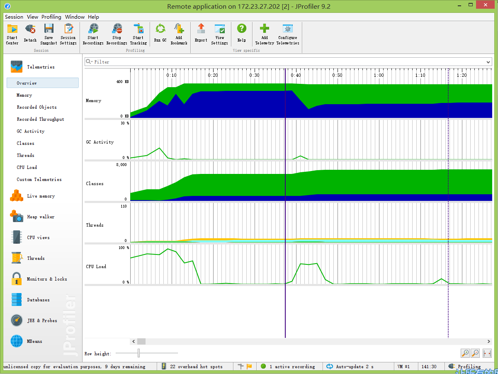

#jprofiler使用

##背景
因为使用jstatd远程连接tomcat不能满足我的要求，故使用jprofiler。

##环境
* server:CentOS 6.7, jdk 1.7 x64, Tomcat 7, JProfiler 9.2
* client:Windows 8.1, jdk 1.8, JProfiler 9.1

##步骤
客户端的安装入门不做介绍了，直接开始远程服务器的安装配置。不得不吐槽一下jprofiler的官网对它的使用介绍好难找。

1. 安装：
下载[jprofiler_linux_9_2_1.sh](http://download-keycdn.ej-technologies.com/jprofiler/jprofiler_linux_9_2_1.sh)。放置在服务器上，并赋予执行权限。运行该shell之后会有几次询问是否继续安装，一路yes。

2. 配置：
主要分服务器环境变量配置和tomcat启动脚本配置：
* 环境变量配置：
```
JPROFILER_HOME=/opt/jprofiler9/bin/linux-x64
export LD_LIBRARY_PATH=$LD_LIBRARY_PATH:$JPROFILER_HOME
```

* catalina.sh配置：
我是在运行参数为“start”的分支下对
```
##modify for jprofiler
CATALINA_OPTS="$CATALINA_OPTS -agentpath:/opt/jprofiler9/bin/linux-x64/libjprofilerti.so=port=8849"
##end modify for jprofiler
```

3. 运行：
现在分别在服务器端启动tomcat，在客户端启动jprofiler即可。
