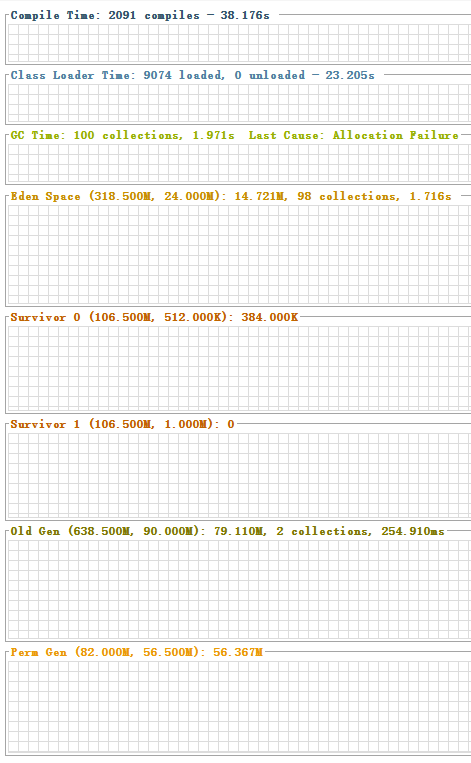
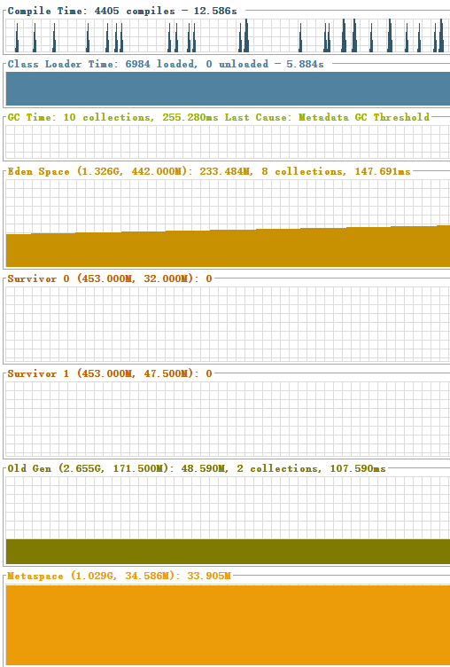
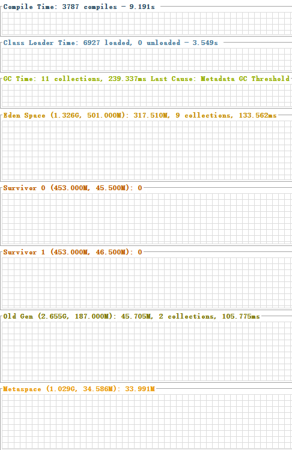

#jvm内存学习笔记

##目的
使用tomcat时，经常出现OOM的异常情况，每次只是调大Metaspace的大小，却不知具体内存分配的情况。故现在对几个常用的tomcat内存使用情况及运行参数进行学习记录。

##环境
jdk：1.8.0版本
tomcat：使用7.0.67和8.0.28版本
os：windows8.1,16GB内存

jdk：1.7.0_79版本
tomcat：使用7版本
os：CentOS release 6.7,4GB内存

工具：visualvm

##默认的实际情况
先来看linux上java7-tomcat7的情况：

windows上java8-tomcat7的情况：

windows上java8-tomcat8的情况：


从图中得出tomcat版本对开辟内存空间并无影响，故对图一图二进行分析：

1. survivor1 : survivor2 : eden : old = 1 : 1 : 3 : 6
2. 持久代大小在java7中默认为82兆，Metaspace（元空间）在java8中默认无限制

几个常见配置：
java7:
``` plain
    持久代：
        -XX:PermSize
        -XX:MaxPermSize
    eden:
        -XX:NewSize
        -XX:MaxNewSize
        -XX:MaxTenuringThreshold 设置在年轻代存活多少次后进入老年代
    s1,s2:
        -XX:SurvivorRatio 设置一个eden代与一个Survivor代的比值
    old:
        -XX:NewRatio 年轻代与老年代的比值
    总的堆内存：
        -Xms,-xmx,-Xmn 分别是初始堆，最大堆，年轻代大小
```

java8中Metaspace的配置:
``` plain
    -XX:MetaspaceSize 初始化元空间的大小（默认64bit VM上34MB）
    -XX:MaxMetaspaceSize 最大元空间的大小（默认本地内存）
    -XX:MinMetaspaceFreeRatio 扩大空间的最小比率，当GC后，内存占用超过这一比率，就会扩大空间
    -XX:MaxMetaspaceFreeRatio 缩小空间的最小比率，当GC后，内存占用低于这一比率，就会缩小空间
```

##参考引用
[Java PermGen 去哪里了?](http://ifeve.com/java-permgen-removed/)