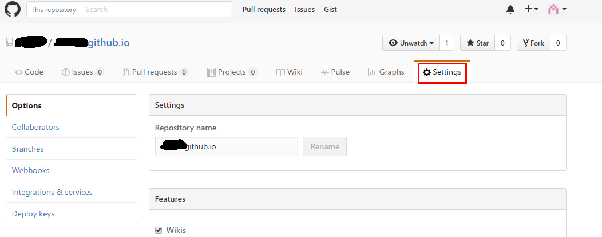

#我的博客搭建之路

##定位
先定位我的需求：想要有个记录我的文字的地方，但是又不喜欢过于公开，想要分享也不难；又不想管理过多的网站事务。我使用markdown语言来写文本，所以还需要支持markdown。

##选
先在网上查了各个不同的网站的特性，可选择的方案有cnblog，简书，github pages。
最后选择了github。

##动手
github pages的大量教程都是配合jekyll或者Hexo来完成的。但是我发现这些框架的搭建都相对需要一定的工作量和维护，而我并不需要这些框架来处理。所以我选择了github pages+sublime Text3+MarkdownPreview。

##步骤
1. 在自己的github上创建一个特定名字的工程，名字为*username*.github.io
2. 在项目的Settings页面中找到“Github Pages”下的**Launch automatic page generator**
3. 选择一个样式并继续，将会在master分支下新增基础页面文件。这一步完成之后访问https://*username*.github.io将会看到你选的首页咯
4. 在项目的根路径下新建doc目录，我们将会在这放置写的md、html

以上即是网站基础的搭建。下面的步骤是关于将md文章转换成html，并发布到首页。

5. 准备好必要的工具，我使用的是Sublime Text3 + Markdown Edit + Markdown Preview
6. 在本地进行文字编辑（可以预览效果），将md文档输出为html，并放置在doc目录下的适当位置
7. 在index.html中加上要发布文章的链接，提交所有新增修改即可。

以上为我现有的博客搭建步骤，需要在其他电脑上写作也只需要安装git和写作的工具，暂时就到这里。
保持一周一更吧！！！